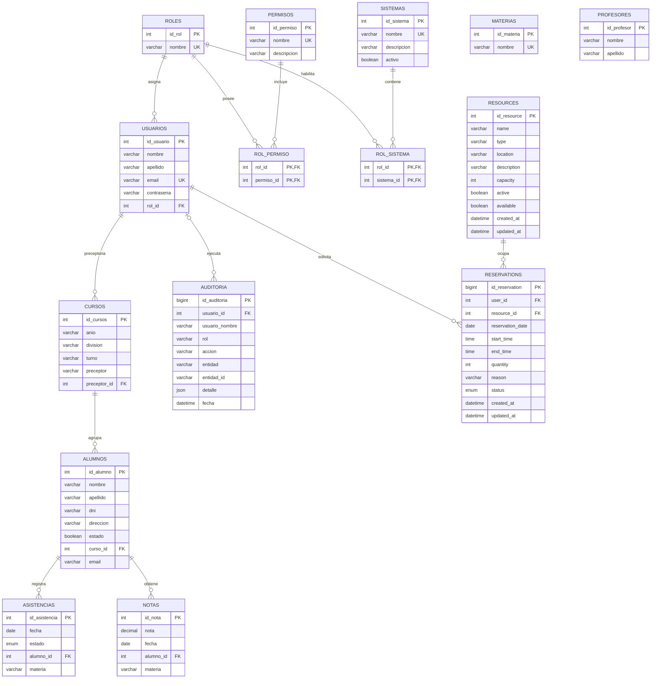

# Base de datos

## Fuente de verdad y estado

La base compartida se llama `ProyectoEstela`. Para una instalación nueva, la fuente canónica es:

1. `db/01-schema.sql`: estructura vigente.
2. `db/02-seed.sql`: permisos, relaciones y datos de demostración.
3. `db/03-migracion-rbac-auditoria.sql`: migración incremental para instalaciones anteriores. En una instalación nueva es redundante, pero es segura y el kit USB también la ejecuta.

Los SQL de `Galisencia/Backend/` y `Galiservas/Backend/` son prototipos históricos, no la fuente de verdad. En particular, `galiservas1.sql` declara varias claves foráneas en sentido inverso. No debe importarse sobre `ProyectoEstela`.

**Estado real:** el esquema canónico implementa identidad, RBAC, Galisencia, Galiservas y auditoría. Galiservas usa los nombres físicos ingleses `resources` y `reservations`; los prototipos históricos `recursos`/`reservas` no son canónicos.

## Diagrama ER

`materias` y `profesores` todavía no tienen una relación declarada con cursos, notas o asistencias: estas dos últimas guardan `materia` como texto. El diagrama evita inventar relaciones que la base no garantiza.

## Tablas compartidas

### `roles`

Propósito: catálogo de perfiles usados por autorización.

| Campo | Tipo y nulabilidad | Clave | Significado |
|---|---|---|---|
| `id_rol` | `INT UNSIGNED NOT NULL AUTO_INCREMENT` | PK | Identificador del rol. |
| `nombre` | `VARCHAR(255) NOT NULL` | UNIQUE | Nombre exacto del rol. |

Reglas: el seed crea `Alumno`, `Preceptor`, `Directivo`, `Administrador Academico`, `Docente` y `Administrador`. La variante sin tilde es la canónica del seed actual.

### `usuarios`

Propósito: identidad única para autenticación y permisos de ambos sistemas.

| Campo | Tipo y nulabilidad | Clave | Significado |
|---|---|---|---|
| `id_usuario` | `INT UNSIGNED NOT NULL AUTO_INCREMENT` | PK | Identidad técnica. |
| `nombre` | `VARCHAR(255) NOT NULL` | | Nombre. |
| `apellido` | `VARCHAR(255) NOT NULL DEFAULT ''` | | Apellido. |
| `email` | `VARCHAR(255) NOT NULL` | UNIQUE | Credencial de inicio de sesión. |
| `contrasena` | `VARCHAR(255) NOT NULL` | | Hash de contraseña, nunca texto plano. |
| `rol_id` | `INT UNSIGNED NULL` | FK a `roles.id_rol` | Perfil RBAC. |

Relación: muchos usuarios pertenecen a un rol. Al borrar el rol, `rol_id` queda `NULL`; ese usuario no puede autenticarse mediante el `INNER JOIN` actual. El alumno de login se vincula con `alumnos` por igualdad de `email`, no mediante FK.

### `sistemas`

Propósito: catálogo de aplicaciones habilitables por rol.

| Campo | Tipo y nulabilidad | Clave | Significado |
|---|---|---|---|
| `id_sistema` | `INT UNSIGNED NOT NULL AUTO_INCREMENT` | PK | Identificador. |
| `nombre` | `VARCHAR(50) NOT NULL` | UNIQUE | Nombre, hoy `Galisencia` en el seed canónico. |
| `descripcion` | `VARCHAR(255) NULL` | | Descripción funcional. |
| `activo` | `TINYINT(1) NOT NULL DEFAULT 1` | | Habilitación global prevista. |

Nota: la autenticación actual no comprueba `activo` ni `rol_sistema`; las páginas deciden el acceso por permisos.

### `permisos`

Propósito: catálogo de capacidades atómicas (`recurso.accion`).

| Campo | Tipo y nulabilidad | Clave | Significado |
|---|---|---|---|
| `id_permiso` | `INT UNSIGNED NOT NULL AUTO_INCREMENT` | PK | Identificador. |
| `nombre` | `VARCHAR(100) NOT NULL` | UNIQUE | Código consumido por PHP. |
| `descripcion` | `VARCHAR(255) NULL` | | Etiqueta humana. |

### `rol_permiso`

Propósito: relación muchos-a-muchos entre roles y permisos.

| Campo | Tipo | Clave | Relación |
|---|---|---|---|
| `rol_id` | `INT UNSIGNED NOT NULL` | PK compuesta, FK | `roles.id_rol`, borrado en cascada. |
| `permiso_id` | `INT UNSIGNED NOT NULL` | PK compuesta, FK | `permisos.id_permiso`, borrado en cascada. |

La PK compuesta impide asignaciones duplicadas.

### `rol_sistema`

Propósito: relación muchos-a-muchos que expresa qué rol puede entrar a qué sistema.

| Campo | Tipo | Clave | Relación |
|---|---|---|---|
| `rol_id` | `INT UNSIGNED NOT NULL` | PK compuesta, FK | `roles.id_rol`, borrado en cascada. |
| `sistema_id` | `INT UNSIGNED NOT NULL` | PK compuesta, FK | `sistemas.id_sistema`, borrado en cascada. |

## Dominio Galisencia

### `cursos`

Propósito: curso/división/turno y preceptor responsable.

| Campo | Tipo y nulabilidad | Clave | Significado |
|---|---|---|---|
| `id_cursos` | `INT UNSIGNED NOT NULL AUTO_INCREMENT` | PK | Identificador. |
| `anio` | `VARCHAR(20) NOT NULL` | | Año como texto. |
| `division` | `VARCHAR(20) NOT NULL` | | División. |
| `turno` | `VARCHAR(20) NOT NULL DEFAULT 'Mañana'` | | Turno. |
| `preceptor` | `VARCHAR(255) NULL` | | Nombre legado para mostrar. |
| `preceptor_id` | `INT UNSIGNED NULL` | FK a `usuarios.id_usuario` | Asignación autorizable real. |

Al borrar al usuario preceptor, la asignación queda nula. No hay restricción única `(anio, division, turno)`. El alcance del preceptor en alumnos se calcula con `preceptor_id`, no con el texto `preceptor`.

### `alumnos`

Propósito: legajo académico básico.

| Campo | Tipo y nulabilidad | Clave | Significado |
|---|---|---|---|
| `id_alumno` | `INT UNSIGNED NOT NULL AUTO_INCREMENT` | PK | Identificador del alumno. |
| `nombre` | `VARCHAR(255) NOT NULL` | | Nombre. |
| `apellido` | `VARCHAR(255) NOT NULL DEFAULT ''` | | Apellido. |
| `dni` | `VARCHAR(255) NULL` | | Documento; no es único actualmente. |
| `direccion` | `VARCHAR(255) NULL` | | Domicilio. |
| `estado` | `TINYINT(1) NOT NULL DEFAULT 1` | | Activo/inactivo previsto. |
| `curso_id` | `INT UNSIGNED NULL` | FK a `cursos.id_cursos` | Curso actual. |
| `email` | `VARCHAR(255) NULL` | | Enlace lógico con `usuarios.email`. |

Al borrar un curso, `curso_id` queda nulo. `DELETE /alumnos.php` hace baja lógica (`estado=0`) y conserva asistencias/notas. Las cascadas solo actuarían ante borrado físico directo.

`alumno_movimientos` preserva cambios de curso y bajas con curso origen/destino, ciclo lectivo, actor y fecha. Para el historial de asistencia, el ciclo se deriva de `YEAR(asistencias.fecha)`; el preceptor puede consultar alumnos de sus cursos actuales.

### `materias`

Propósito: catálogo de materias.

| Campo | Tipo | Clave | Significado |
|---|---|---|---|
| `id_materia` | `INT UNSIGNED NOT NULL AUTO_INCREMENT` | PK | Identificador. |
| `nombre` | `VARCHAR(255) NOT NULL` | UNIQUE | Nombre. |

No existe FK desde asistencias/notas; por eso pueden aparecer diferencias de tildes o nombres.

### `asistencias`

Propósito: un estado de asistencia por alumno, materia y fecha.

| Campo | Tipo y nulabilidad | Clave | Significado |
|---|---|---|---|
| `id_asistencia` | `INT UNSIGNED NOT NULL AUTO_INCREMENT` | PK | Identificador. |
| `fecha` | `DATE NOT NULL` | UNIQUE parcial | Día lectivo. |
| `estado` | `ENUM('presente','tarde','ausente') NOT NULL DEFAULT 'presente'` | | Estado válido. |
| `alumno_id` | `INT UNSIGNED NULL` | FK y UNIQUE parcial | Alumno; borrado en cascada. |
| `materia` | `VARCHAR(255) NOT NULL` | UNIQUE parcial | Materia textual. |

La clave única `(alumno_id, materia, fecha)` evita duplicados. El POST es un *upsert*: actualiza el estado si ya existe. Reportes pondera presente `1`, tarde `0,5`, ausente `0`.

### `notas`

Propósito: calificaciones por alumno y materia.

| Campo | Tipo y nulabilidad | Clave | Significado |
|---|---|---|---|
| `id_nota` | `INT UNSIGNED NOT NULL AUTO_INCREMENT` | PK | Identificador. |
| `nota` | `DECIMAL(4,2) NULL` | | Calificación; la BD no limita rango. |
| `fecha` | `DATE NULL` | | Fecha, el API usa `CURDATE()`. |
| `alumno_id` | `INT UNSIGNED NULL` | FK a `alumnos.id_alumno` | Alumno; borrado en cascada. |
| `materia` | `VARCHAR(255) NOT NULL` | | Materia textual. |

### `profesores`

Propósito: catálogo mínimo de docentes, actualmente sin endpoints ni relaciones.

| Campo | Tipo | Clave | Significado |
|---|---|---|---|
| `id_profesor` | `INT UNSIGNED NOT NULL AUTO_INCREMENT` | PK | Identificador. |
| `nombre` | `VARCHAR(255) NOT NULL` | | Nombre. |
| `apellido` | `VARCHAR(255) NOT NULL DEFAULT ''` | | Apellido. |

## Auditoría

### `auditoria`

Propósito: trazabilidad común de operaciones sensibles.

| Campo | Tipo y nulabilidad | Clave | Significado |
|---|---|---|---|
| `id_auditoria` | `BIGINT UNSIGNED NOT NULL AUTO_INCREMENT` | PK | Secuencia del evento. |
| `usuario_id` | `INT UNSIGNED NULL` | FK a `usuarios.id_usuario`, índice | Actor. Al borrar usuario queda nulo. |
| `usuario_nombre` | `VARCHAR(255) NULL` | | Copia histórica del nombre. |
| `rol` | `VARCHAR(100) NULL` | | Copia histórica del rol. |
| `accion` | `VARCHAR(100) NOT NULL` | | Código de acción. |
| `entidad` | `VARCHAR(100) NOT NULL` | | Tipo afectado. |
| `entidad_id` | `VARCHAR(100) NULL` | | ID flexible de la entidad. |
| `detalle` | `JSON NULL` | | Datos relevantes del cambio. |
| `fecha` | `DATETIME NOT NULL DEFAULT CURRENT_TIMESTAMP` | índice | Momento del servidor. |

Hoy se auditan cambios de alumnos, cursos, asistencias, notas, usuarios, recursos y reservas. Las operaciones sensibles de alumnos registran también un movimiento estructurado.

## Dominio Galiservas

### `resources`

Propósito: inventario reservable por tipo y ubicación. Una fila puede representar varias unidades equivalentes.

| Campo | Tipo y nulabilidad | Clave | Propósito |
|---|---|---|---|
| `id_resource` | `INT UNSIGNED NOT NULL AUTO_INCREMENT` | PK | Identificador. |
| `name` | `VARCHAR(150) NOT NULL` | UNIQUE parcial | Nombre. |
| `type` | `VARCHAR(50) NOT NULL` | | Subtipo, por ejemplo `desktop_pc`, `notebook` o `camara`. |
| `category` | `ENUM('hardware_pc','audiovisual') NOT NULL` | | Categoría obligatoria para filtros y reportes. |
| `location` | `VARCHAR(150) NOT NULL` | UNIQUE parcial | Ubicación. |
| `description` | `VARCHAR(500) NULL` | | Descripción. |
| `capacity` | `INT UNSIGNED NOT NULL DEFAULT 1` | CHECK `> 0` | Unidades simultáneas. |
| `active` | `TINYINT(1) NOT NULL DEFAULT 1` | índice parcial | Habilitación administrativa. |
| `available` | `TINYINT(1) NOT NULL DEFAULT 1` | índice parcial | Disponibilidad global manual. |
| `created_at` | `DATETIME NOT NULL DEFAULT CURRENT_TIMESTAMP` | | Alta. |
| `updated_at` | `DATETIME`, actualización automática | | Último cambio. |

La combinación `(name, location)` es única. El DELETE de API no borra: pone `active=0` y `available=0`.

El seed incluye aulas 208/209/210 y recursos del Pañol: 30 notebooks, teclados, mouse, CPUs, proyectores, cámaras, micrófonos, parlantes y cables.

### `reservations`

Propósito: solicitud de una cantidad de unidades durante un intervalo del mismo día.

| Campo | Tipo y nulabilidad | Clave | Propósito |
|---|---|---|---|
| `id_reservation` | `BIGINT UNSIGNED NOT NULL AUTO_INCREMENT` | PK | Identificador. |
| `user_id` | `INT UNSIGNED NOT NULL` | FK a `usuarios.id_usuario` | Solicitante; borrado restringido. |
| `resource_id` | `INT UNSIGNED NOT NULL` | FK a `resources.id_resource` | Recurso; borrado restringido. |
| `reservation_date` | `DATE NOT NULL` | índice de franja | Día. |
| `start_time` | `TIME NOT NULL` | índice, CHECK | Inicio. |
| `end_time` | `TIME NOT NULL` | índice, CHECK | Fin, mayor que inicio. |
| `quantity` | `INT UNSIGNED NOT NULL DEFAULT 1` | CHECK `> 0` | Unidades solicitadas. |
| `reason` | `VARCHAR(500) NOT NULL` | | Motivo. |
| `status` | ENUM no nulo, default `confirmada` | índice | `pendiente` legado, `confirmada`, `rechazada`, `cancelada` o `completada`. |
| `created_at` | `DATETIME NOT NULL DEFAULT CURRENT_TIMESTAMP` | | Alta. |
| `updated_at` | `DATETIME`, actualización automática | | Último cambio. |

Reglas: el recurso debe estar activo/disponible; la fecha no puede ser pasada; cantidad no puede superar capacidad; para franjas solapadas se suma la cantidad de reservas activas y se rechaza si excede capacidad. La API bloquea el recurso con `FOR UPDATE`; gana la primera transacción que confirma. Las altas quedan `confirmada` automáticamente y la disponibilidad de una franja es `capacity - SUM(quantity)` de reservas solapadas. Usuarios comunes leen, editan y cancelan solo reservas propias activas. `reservas.administrar` permite ver todas, finalizar y reportar.

## Integridad y límites conocidos

- Los permisos se validan en PHP consultando `usuarios -> rol_permiso -> permisos`; ocultar botones no sustituye esta comprobación.
- `alumnos.email` no tiene FK ni UNIQUE contra `usuarios.email`.
- La relación lógica entre `alumnos.email` y `usuarios.email` aún no es una FK.
- La base permite `alumno_id NULL` en asistencia/nota, aunque la API exige un alumno activo y aplica alcance propio/curso.
- `resources.available` sigue siendo un interruptor global; las unidades libres temporales se calculan para la fecha y franja consultadas.
- La regla de regularidad es menos de `75%`; alumnos sin registros se muestran sin datos y no inflan el promedio.
