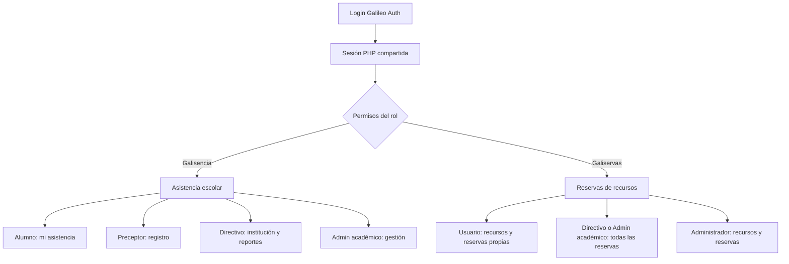

# Mapa de navegación

## Aclaración de término

En el pedido original, "mail de navegación" se interpreta como **mapa de navegación**: el recorrido de pantallas, roles y sistemas. No se implementa envío de correo electrónico.

## Entrada y dos sistemas



Estado demostrable hoy:

- **Galisencia React:** rutas y vistas por rol, con API real si Apache está disponible y fallback mock si no responde.
- **Galileo Auth PHP:** login, menú de sistemas y páginas PHP básicas protegidas por sesión/permisos.
- **Galiservas PHP:** dashboard legado condicionado por permisos.
- **Galiservas React independiente:** gestor conectado a sesión, recursos y reservas de la API compartida.
- **Demo visual alternativa:** `Galisencia/Frontend/public/galiservas/index.html` es estática y no debe confundirse con la app integrada en `:5174`.

## Galisencia React por rol

URL USB: `http://localhost:5173`.

| Rol UI | Inicio | Navegación visible | Función |
|---|---|---|---|
| Alumno | `/alumno` | Mi asistencia | Porcentaje e historial del alumno. |
| Preceptor | `/preceptor` | Registrar asistencia, Reportes | Tomar asistencia y consultar reportes. |
| Directivo | `/directivo` | Institucional, Reportes | Indicadores, riesgo y análisis. |
| Admin | `/admin` | Panel, Gestión académica, Reportes, Auditoría, Usuarios | Gestión transversal. |

`/login` permite seleccionar un rol visual, pero cuando responde el backend prevalece el rol derivado de la base. `RutaProtegida` redirige al inicio del usuario. Esto mejora UX, no reemplaza RBAC del servidor.

El enlace lateral "Galiservas" se muestra únicamente a roles autorizados y abre la aplicación independiente en `http://localhost:5174`.

## Galiservas React por alcance

| Perfil efectivo | Navegación | Alcance backend |
|---|---|---|
| Preceptor, Docente | Panel, Aulas, Pañol, Mis reservas, Nueva reserva | Recursos activos y reservas propias confirmadas automáticamente. |
| Administrador | Panel, Aulas, Pañol, Reservas, Reportes, Mis reservas, Nueva reserva | Todas las reservas, reportes y API de recursos. |
| Alumno, Directivo, Administrador Académico | Sin acceso | UI y API rechazan la sesión para Galiservas. |

Al cargar, Galiservas llama `GET sesion.php`; si la cookie es válida recupera usuario, permisos y sistemas habilitados. La UI exige `galiservas.acceder`, mientras `reservas.php`, `recursos.php` y reportes vuelven a validar `rol_sistema` y permisos. El logout destruye la sesión y redirige a Galisencia.

## Navegación PHP compartida

Base: `http://localhost/Proyecto-SSO/Galisencia/Galileo_Auth`.

```text
index.php -> login.php -> dashboard.php
                         |-> galisencia/dashboard.php
                         |    |-> asistencia.php
                         |    `-> alumnos.php
                         |-> galiservas/dashboard.php (requiere reservas.ver)
                         |-> admin/usuarios.php (solo rol Administrador)
                         `-> admin/roles.php (solo rol Administrador)

logout.php -> destruye sesión -> login.php
```

## Flujo SSO con cookie

1. El cliente envía email/contraseña a `api/login.php` o al formulario `login.php`.
2. PHP busca `usuarios`, verifica el hash con `password_verify` y regenera el ID para evitar fijación de sesión.
3. Guarda `id_usuario`, nombre, apellido, email, rol y `rol_id` en `$_SESSION`.
4. PHP entrega `PHPSESSID`; el navegador la conserva para `localhost`.
5. Cada endpoint llama `api_login_requerido()` y luego consulta el permiso en BD con `api_requerir_permiso()`.
6. Al cambiar de sistema bajo el mismo host/instancia PHP, la cookie puede identificar la misma sesión; cada sistema debe volver a validar su permiso.
7. `api/logout.php` destruye sesión/cookie y ambos frontends lo utilizan. Galiservas redirige después a Galisencia.

En USB, ambos Vite proxifican `/api` hacia Apache para compartir cookie sin depender de CORS. El selector de rol y `localStorage` nunca conceden permisos.

## Guion de exposición (8 minutos)

### 0:00-0:45 - Problema

"El colegio tenía dos necesidades: seguimiento de asistencia y reserva de espacios. Centralizamos identidad y permisos para no duplicar usuarios y para que cada acción dependa del rol."

Mostrar el diagrama y explicar que ambas aplicaciones consumen la API y sesión compartidas.

### 0:45-1:40 - Arquitectura

Mostrar `README.md`: React/Vite en interfaz, PHP/PDO en API, MySQL `ProyectoEstela`. Explicar que el kit USB reproduce la arquitectura con XAMPP, mientras Docker es otra modalidad.

### 1:40-2:30 - Login y SSO

Abrir `http://localhost:5173`, ingresar con `preceptor@galileo.edu.ar` / `demo1234`. Explicar cookie de sesión, hash bcrypt y consulta de permisos backend. No decir que `localStorage` es SSO.

### 2:30-3:45 - Preceptor

Mostrar cursos/alumnos y registrar una asistencia. Destacar el *upsert* por alumno, materia y fecha. Si la integración real falla, mostrar el indicador de modo mock y no afirmar persistencia.

### 3:45-4:45 - Directivo

Salir de la UI y entrar con `directivo@galileo.edu.ar`. Mostrar indicadores y riesgo: presente vale 1, tarde 0,5, umbral 75%.

### 4:45-5:50 - Administración

Entrar con `admin@galileo.edu.ar`, cuenta **Administrador**. Mostrar gestión, usuarios y auditoría. Comparar con `academica@galileo.edu.ar`, que no gestiona usuarios/recursos.

### 5:50-6:40 - Datos y auditoría

Mostrar el Mermaid de `DATABASE.md`: usuario-rol-permiso, curso-alumno-asistencia y auditoría. Señalar FKs, borrado en cascada y copias históricas de actor/rol.

### 6:40-7:20 - Galiservas

Abrir `http://localhost:5174`, restaurar/iniciar sesión, crear una reserva y explicar capacidad/solapamiento. Como Administrador, mostrar todas las reservas y sus estados.

### 7:20-8:00 - Cierre y seguridad

Resumir: identidad común, RBAC backend, asistencia por ciclo, reservas automáticas con concurrencia y despliegue portátil. Reconocer que los períodos trimestrales aún no están modelados de forma independiente.

## Antes de presentar

1. Ejecutar `USB-Setup\VERIFICAR.bat`.
2. Tener las seis cuentas demo visibles.
3. No ejecutar `REINICIAR_BASE_DEMO.bat` durante la exposición salvo necesidad.
4. Tener `docs/PRESENTACION.md` abierto como ayuda.
5. Probar exactamente una escritura y recargar para comprobar si fue backend o mock.
