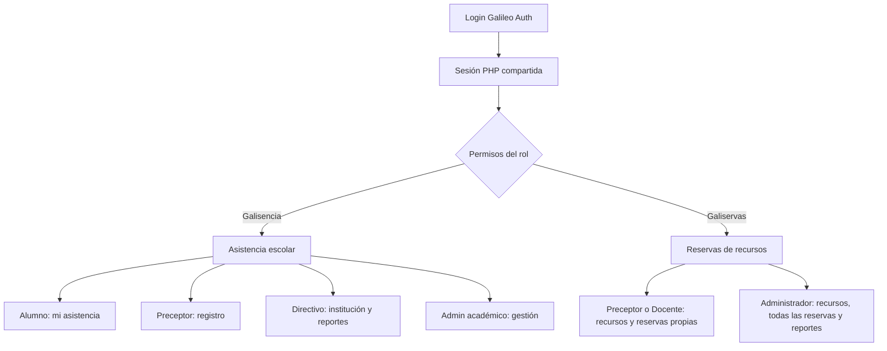

# Mapa de navegación

## Aclaración de término

En el pedido original, "mail de navegación" se interpreta como **mapa de navegación**: el recorrido de pantallas, roles y sistemas. No se implementa envío de correo electrónico.

## Entrada y dos sistemas

```mermaid
flowchart TD
    L[Login Galileo Auth] --> S[Sesión PHP compartida]
    S --> P{Permisos del rol}
    P -->|Galisencia| G[Asistencia escolar]
    P -->|Galiservas| R[Reservas de recursos]
    G --> A1[Alumno: mi asistencia]
    G --> A2[Preceptor: registro]
    G --> A3[Directivo: institución y reportes]
    G --> A4[Admin académico: gestión]
    R --> R1[Preceptor o Docente: recursos y reservas propias]
    R --> R3[Administrador: recursos, todas las reservas y reportes]
```

Estado demostrable hoy:

- **Galisencia React:** rutas y vistas por rol, con datos de la API; si la API no responde muestra "Sin conexión con el servidor" y no carga datos de demostración.
- **Galileo Auth PHP:** solo API JSON (`api/*.php`); las páginas PHP legadas se eliminaron.
- **Galiservas React independiente:** gestor conectado a sesión, recursos y reservas de la API compartida.

## Galisencia React por rol

URL con Docker: `http://localhost:3000/` (con `npm run dev`, `http://localhost:5173`).

| Rol UI | Inicio | Navegación visible | Función |
|---|---|---|---|
| Alumno | `/alumno` | Mi asistencia, Mi horario | Porcentaje e historial del alumno y horario de su curso. |
| Preceptor (también Docente) | `/preceptor` | Registrar asistencia, Horarios, Reportes | Tomar asistencia, ver horarios (el Docente ve "Mis clases") y consultar reportes. |
| Directivo | `/directivo` | Panel institucional, Horarios, Reportes | Indicadores, riesgo, análisis y consulta de horarios. |
| Admin (Administrador y Administrador Académico) | `/admin` | Panel, Gestión académica, Horarios, Reportes, Auditoría, Usuarios | Gestión transversal; el backend igual limita por permiso lo que cada uno puede hacer. |

`/login` solo pide email y contraseña: no hay selector de rol. El rol sale siempre de la base y se relee en cada request. Si la cuenta tiene `debe_cambiar_password`, Galisencia muestra primero la pantalla para elegir una contraseña nueva. `RutaProtegida` redirige al inicio del usuario. Esto mejora UX, no reemplaza RBAC del servidor.

### Horarios

La página de horarios muestra la grilla semanal con el formato de los horarios del colegio: 12 módulos de 07:40 a 21:40, la banda de "Cambio de turno", clases de uno o más módulos y celdas partidas en dos grupos. En cada clase se ve el aula (arriba a la derecha), la materia y el docente.

- **Alumno:** "Mi horario", el de su curso.
- **Docente:** "Mis clases", con el curso en cada clase.
- **Preceptor y Directivo:** eligen año y división y consultan sin editar.
- **Administrador Académico y Administrador:** además editan: un módulo libre abre "Nueva clase" (materia, docente, aula, grupo, duración y vigencia) y una clase abre "Editar clase" o "Quitar clase". Los choques que detecta la API (docente o aula ocupados, celda tomada) se muestran en el editor.
- **Exportación:** "Imprimir / PDF" (A4 apaisado, blanco y negro), "Excel" del curso y, para quien edita, "Excel de todos los cursos" (una hoja por curso).

### Suplencias

- **Preceptor:** al pie de "Registrar asistencia", la sección "Mis suplencias" permite cubrir un curso ajeno (desde hoy, hasta 30 días, motivo opcional) y quitar las propias. Mientras la suplencia está vigente, el curso aparece en el selector de asistencia.
- **Administrador Académico y Administrador:** en "Gestión académica", la pestaña "Suplencias" asigna cualquier preceptor a cualquier curso y lista todas las suplencias con su estado (Vigente, Próxima, Finalizada).

El enlace lateral "Galiservas" se muestra únicamente a roles autorizados y abre Galiservas en `/galiservas/`, en el mismo origen: no hace falta volver a iniciar sesión.

## Galiservas React por alcance

| Perfil efectivo | Navegación | Alcance backend |
|---|---|---|
| Preceptor, Docente | Panel, Aulas, Pañol, Calendario, Mis reservas, Nueva reserva | Recursos activos y reservas propias confirmadas automáticamente. |
| Administrador | Panel, Aulas, Pañol, Calendario, Reservas, Recursos, Reportes, Mis reservas, Nueva reserva | Todas las reservas, reportes y API de recursos. |
| Alumno, Directivo, Administrador Académico | Sin acceso | UI y API rechazan la sesión para Galiservas. |

**Calendario:** vistas de día, semana (lunes a domingo, grilla de 07:00 a 22:00 que se estira si hay reservas fuera de ese horario) y mes, con navegación anterior/hoy/siguiente y filtro por categoría (Hardware de PC o Audiovisuales), que aplica el servidor. Las canceladas se ocultan salvo que se marque "Mostrar canceladas". Al elegir una reserva se ve su detalle (el administrador ve además quién reservó) y, si sigue activa y es propia o se administra, se puede editar o cancelar. El Administrador ve todas las reservas; el resto, solo las propias.

Al cargar, Galiservas llama `GET sesion.php`; si la cookie es válida recupera usuario, permisos y sistemas habilitados. La UI exige `galiservas.acceder`, mientras `reservas.php`, `recursos.php` y `reportes_reservas.php` vuelven a validar `rol_sistema` (`api_requerir_sistema`) y permisos. Si la cuenta todavía tiene la contraseña inicial, Galiservas pide cambiarla desde Galisencia. El logout destruye la sesión y redirige a Galisencia.

## Login único

Galiservas no tiene formulario propio: si no hay sesión, redirige a `/login?next=/galiservas/` de Galisencia. Después del login (y del cambio de contraseña inicial, si la cuenta lo tiene pendiente) Galisencia vuelve al destino. `next` solo acepta rutas del mismo origen (o, en desarrollo, la URL configurada de Galiservas) para evitar redirecciones abiertas.

El cierre de sesión en cualquiera de las dos apps destruye la sesión compartida y avisa a la otra con `BroadcastChannel("galileo-sesion")`: las pestañas abiertas de la otra app vuelven al login sin esperar al siguiente pedido.

## Flujo SSO con cookie

1. El cliente envía email/contraseña a `api/login.php`.
2. PHP busca `usuarios`, verifica el hash con `password_verify` y regenera el ID para evitar fijación de sesión.
3. Guarda `id_usuario`, nombre, apellido, email, rol y `rol_id` en `$_SESSION`. En cada request siguiente `_common.php` relee rol y datos desde `usuarios`/`roles` (`api_rol_actual()`), así un cambio de rol aplica sin volver a iniciar sesión.
4. PHP entrega `PHPSESSID`; el navegador la conserva para `localhost`.
5. Cada endpoint llama `api_login_requerido()` y luego consulta el permiso en BD con `api_requerir_permiso()`.
6. Al cambiar de sistema bajo el mismo host/instancia PHP, la cookie puede identificar la misma sesión; cada sistema debe volver a validar su permiso.
7. `api/logout.php` destruye sesión/cookie y ambos frontends lo utilizan. Galiservas redirige después a Galisencia.

Con Docker hay un solo origen: el proxy de entrada sirve Galisencia en `/`, Galiservas en `/galiservas/` y la API en `/api/`, así que la cookie se comparte sin CORS. En desarrollo, los Vite de las dos apps reenvían `/api` al backend del perfil `dev` (`docker compose --profile dev up`, `:8080`). `localStorage` nunca concede permisos.

## Guion de exposición (8 minutos)

### 0:00-0:45 - Problema

"El colegio tenía dos necesidades: seguimiento de asistencia y reserva de espacios. Centralizamos identidad y permisos para no duplicar usuarios y para que cada acción dependa del rol."

Mostrar el diagrama y explicar que ambas aplicaciones consumen la API y sesión compartidas.

### 0:45-1:40 - Arquitectura

Mostrar `README.md`: React/Vite en interfaz, PHP/PDO en API, MySQL `ProyectoEstela`. Explicar que todo se levanta con Docker Compose: MySQL, backend PHP y los dos frontends servidos por nginx.

### 1:40-2:30 - Login y SSO

Abrir `http://localhost:3000`, ingresar con `preceptor@galileo.edu.ar` / `demo1234` (el primer ingreso pide cambiar la contraseña). Explicar cookie de sesión, hash bcrypt y consulta de permisos backend. No decir que `localStorage` es SSO.

### 2:30-3:45 - Preceptor

Mostrar cursos/alumnos y registrar una asistencia. Destacar el *upsert* por alumno, materia y fecha. Si la integración falla, la app muestra el aviso "Sin conexión con el servidor" en lugar de datos.

### 3:45-4:45 - Directivo

Salir de la UI y entrar con `directivo@galileo.edu.ar`. Mostrar indicadores y riesgo: presente vale 1, tarde 0,5, umbral 75%.

### 4:45-5:50 - Administración

Entrar con `admin@galileo.edu.ar`, cuenta **Administrador**. Mostrar gestión, usuarios y auditoría. Comparar con `academica@galileo.edu.ar`, que no gestiona usuarios/recursos.

### 5:50-6:40 - Datos y auditoría

Mostrar el Mermaid de `DATABASE.md`: usuario-rol-permiso, curso-alumno-asistencia y auditoría. Señalar FKs, borrado en cascada y copias históricas de actor/rol.

### 6:40-7:20 - Galiservas

Abrir `http://localhost:3000/galiservas/` (la sesión de Galisencia ya vale), crear una reserva y explicar capacidad/solapamiento. Como Administrador, mostrar todas las reservas y sus estados.

### 7:20-8:00 - Cierre y seguridad

Resumir: identidad común, RBAC backend, asistencia por ciclo, reservas automáticas con concurrencia y despliegue con Docker. Reconocer que los períodos trimestrales aún no están modelados de forma independiente.

## Antes de presentar

1. Ejecutar `docker compose ps` y comprobar que los servicios estén `running`/`healthy`.
2. Tener las seis cuentas demo visibles (y las contraseñas nuevas si ya se cambió la inicial).
3. No ejecutar `docker compose down -v` durante la exposición: borra la base. Solo usarlo si hace falta volver al seed desde cero.
4. Tener `docs/PRESENTACION.md` abierto como ayuda.
5. Probar una escritura y recargar para comprobar que persistió.
